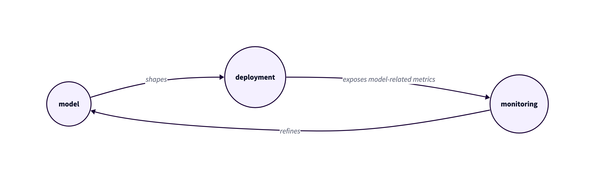

Poll
====

This experimental repo gives an example of how the web server usage model can be used to shape
its infrastructure definition and configuration.

This repo is a Go module. Packages `votes` with `cmd/pollsvc` provide the web service implementation that 
exposes REST API for collecting votes that represent if audience agrees with a speaker during a
presentation.

This repo is also a [CUE](https://cuelang.org) module. Package `infra` contains the definition of the 
service usage model expressed in CUE (see `infra/model`), as well as the deployment code (see `infra/deployment`)
configured with the parameters derived from the usage model.

Folder `present` contains the presentation on the expectations driven deployment that can be launched using a tool
with the same name [from the Go x/tools repository](https://pkg.go.dev/golang.org/x/tools/present).

## Dealing with the infra

To deploy:
```
cd infra/deployment
./plan.sh
./deploy.sh
```

To confirm the deployment matches the usage model constraints:
```
cd infra/deployment/state
./check.sh
```

## Expectations driven deployment

Infrastructure code can be shaped (parameterized) with our expectations about the system coming
from the usage model (how many users we expect, how often they will interact with the system,
what kind of data we'll need to store). 

These expectations also help with identifying the metrics that should be exposed with our deployment:
what can validate (confirm or prove wrong) our expectations.

Finally, with the data obtained from the live system, our original model can be refined, leading to
an update in the deployment.




### Presentation video:
[](http://www.youtube.com/watch?v=IQ7l7AR0V5Y)
